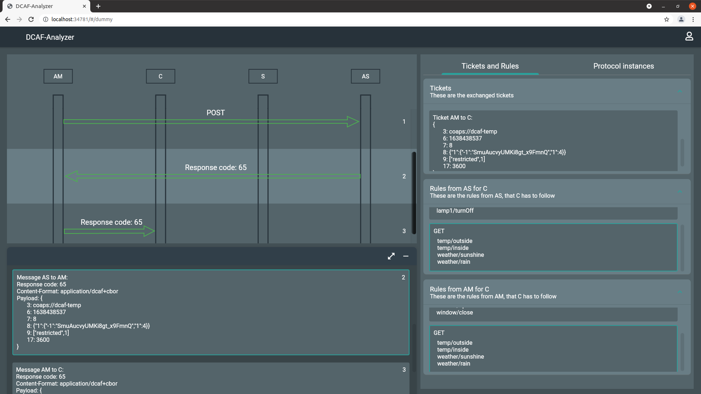

# DCAF Protocol Visualization 
This project was created for analyzing the DCAF protocol messages in a WebGUI via Flutter.
The used DCAF implementation can be found [here](https://gitlab.informatik.uni-bremen.de/DCAF/dcaf)
The original DCAF implementation was modified to implement the necessary features.

## Installation Guide for DCAF (from [here](https://gitlab.informatik.uni-bremen.de/DCAF/dcaf))
### Prerequisites
The following packages are required for building libdcaf:
- libcoap version 4.2 or above, build with either OpenSSL, Mbed TLS, or tinydtls.
- yaml-cpp
- cn-cbor

### Building
1. First, run autogen.sh to create the required autoconf files, then
2. do configure, followed by
3. make
4. and make install if required.

## Installation Guide for the Flutter project
1. install a webBrowser: Google Chrome is recommended and was used during development
2. install [Flutter](https://flutter.dev/)
4. for the secure connection between the GUI and the Server of AM a secure Websocket was used 
   with a certificate for development. You may need to add this certificate to the trusted list 
   in your webbrowser where you want to run the Flutter project. 
   So add the localhost.crt in /dcaf/am/keys to trusted certificates and also the RootCA to 
   trusted authorities (In Google Chrome: Settings -> Privacy and security -> Security -> Manage certificates)

## Usage
1. build AM: in dcaf/ folder type: make clean and make -k
2. in dcaf/am run AM via: ./dcaf-am -v9,9 -C config-nohost.yaml -H
3. build examples: in dcaf/examples folder type: make clean and make
4. run example DCAF server in dcaf/examples folder type: ./s -v9,9 -a coaps://[::1]:7744/authorize -k geheim
5. run flutter website: in flutter_app/ folder type for example: flutter run -d chrome --web-renderer html --profile
6. on the website login via username, password and address ("admin", "password", "localhost:8040")
7. run example DCAF client in dcaf/examples folder: ./dcaf-client -v9,9 -a coaps://[::1]:7744/authorize -u node1 -k secretPSK coap://dcaf-temp/restricted
8. now messages should be seen on the website

